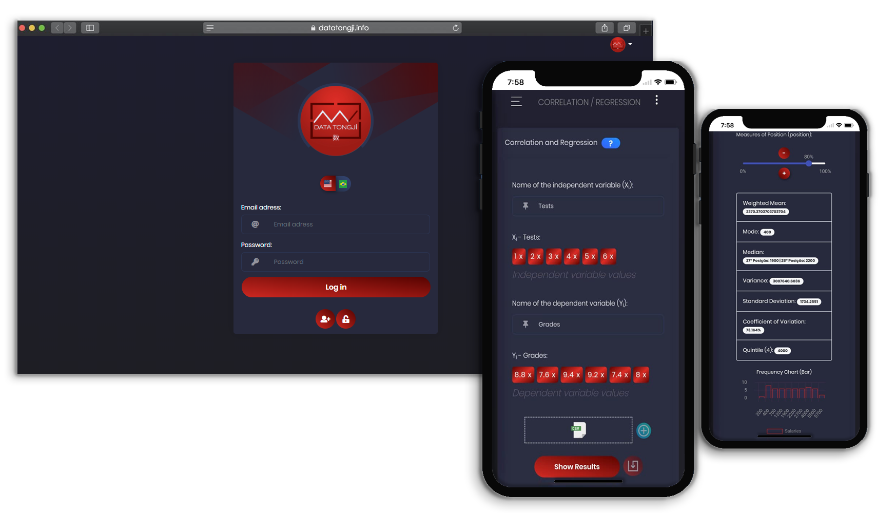

<p align="center">
  
</p>

# Data Tongjì
> <p align="justify">Data Tongjì is a website made for educational purposes to portray specific statistic analysis, based on Node.JS and ReactJS. At this repo, you will find the frontend of the application.</p>

<p align="justify">
This project was developed in order to optimize some statistic analyzes (Descriptive Analysis, Probability and Correlation/Regression) by creating a web system which focuses on the presentation and interpretation of the expected data analysis results.
</p>

<p align="center">
  
</p>

## Technologies

  - Reactjs;
  - Node.js ([Backend](https://github.com/Data-Tongji/datatongji-backend));
  - [Check package.json](/src/package.json).

## Installation

```sh
yarn install
```

## Test

```sh
yarn start
```

## Release History

* 1.0.0
    * Published

## Authors

[Leonardo Ronne](https://github.com/leoronne) – leoronne@gmail.com

[Lucas Damas](https://github.com/lucasdcorrea1) – lucas.dcorrea1@gmail.com


## Contributing

Please read [CONTRIBUTING](https://github.com/Data-Tongji/datatongji/blob/master/CONTRIBUTING.md) for details on our code of conduct, and the process for submitting pull requests to us.

## License

[](http://badges.mit-license.org)
- **[MIT license](https://github.com/Data-Tongji/datatongji/blob/master/LICENCE)**
- Copyright 2019 © <a href="https://github.com/Data-Tongji" target="_blank">Data Tongjì</a>.
